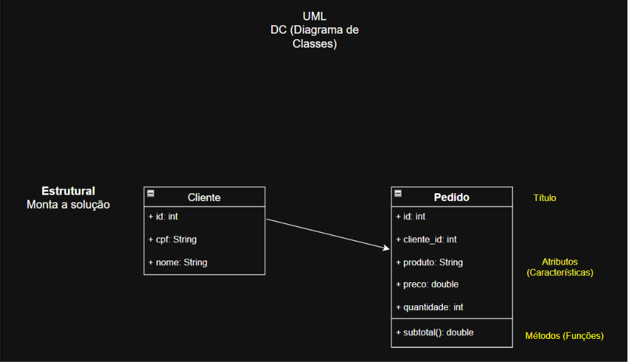
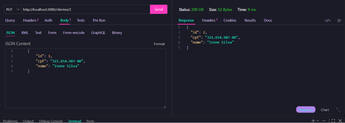
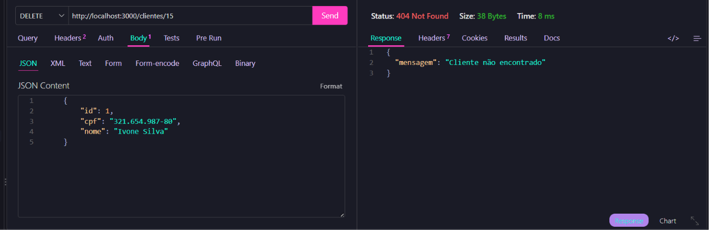
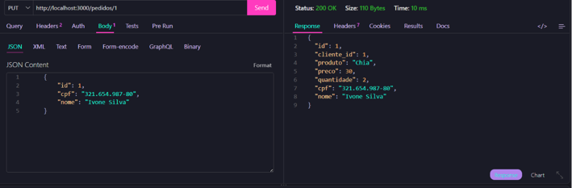
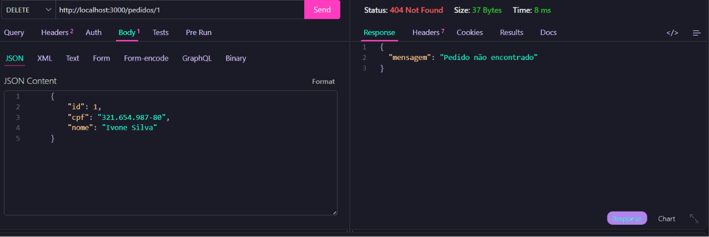

# Pedidos Backend MVC DC 
Back-end com duas coleções mockup JSON clientes e pedidos, CRUD, para aprender, MVC e UML diagrama de classes

## Diagrama 



## Tecnologias 
- Node.js
- VsCode (Thunder Client)
- JavaScript 
- MVC 

## Passos para testar 
- Clone este repositório e abra com VsCode 
- Tnstale as dependências e execute com os seguintes comandos no terminal : 

```
npm install
npm run dev
```
## Exemplos de rotas : Alterar e Excluir 

Alterar Cliente 


Excluir Cliente 


Alterar Pedido 


Excluir Pedido
